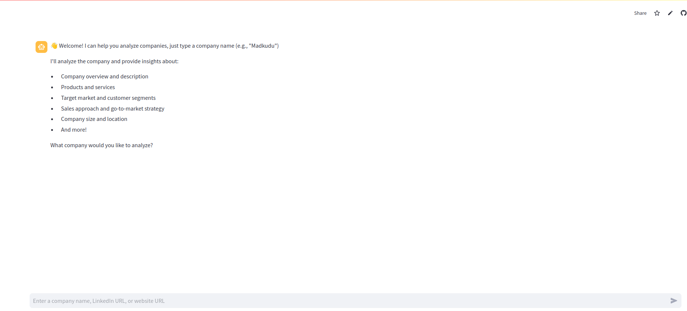
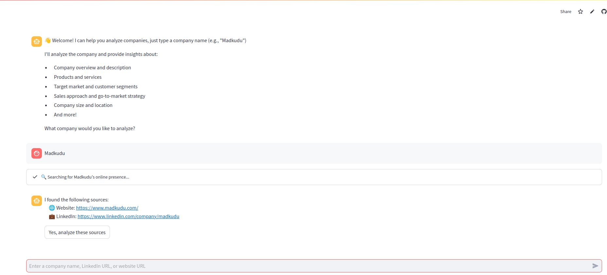
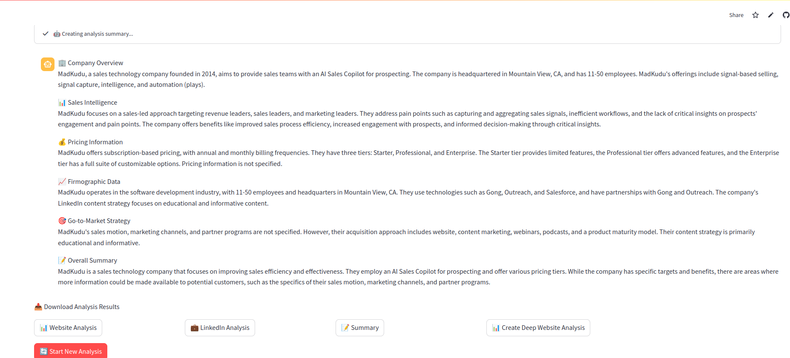

# B2B Company Analyzer

This application helps analyze B2B companies by gathering and analyzing information from their websites and LinkedIn profiles. It provides comprehensive insights about company overview, sales intelligence, pricing, firmographic data, and go-to-market strategy.

## Features

- 🔍 Company Search: Find and analyze companies by name
- 🌐 Website Analysis: Deep crawling and analysis of company websites
- 💼 LinkedIn Integration: Analysis of company LinkedIn profiles
- 📊 Comprehensive Reports: Detailed analysis across multiple dimensions
- 📥 Exportable Results: Download analysis results in JSON format

## Project Structure

### Core Files

- `app.py`: Main Streamlit application file that handles the user interface and orchestrates the analysis flow
- `get_websites_links.py`: Handles company website discovery using Google Custom Search
- `website_scraping.py`: Manages website crawling and content extraction
- `website_analyzer.py`: Analyzes website content using LLM to extract business intelligence
- `website_summarizer.py`: Creates comprehensive summaries from analyzed data
- `linkedin_analyzer.py`: Handles LinkedIn profile analysis

### Supporting Files

- `requirements.txt`: Lists all Python dependencies
- `.env`: Configuration file for API keys and settings
- `tests/`: Directory containing test files

## Setup Instructions

See [SETUP.md](SETUP.md) for detailed setup instructions.

## Usage

### Live Demo
The application is live and can be accessed at:
- https://madkudu-project-app.streamlit.app/
- 
### How to Use

#### 1. Starting an Analysis
1. Launch the application
2. You'll be greeted with a welcome message
3. In the chat input field at the bottom, enter a company name (e.g., "Madkudu")



#### 2. Source Verification
After entering a company name:
- The bot will search for the company's online presence
- It will display the found sources (website and/or LinkedIn profile)
- Click "Yes, analyze these sources" to proceed with the analysis



#### 3. Analysis Results
The bot will present a detailed summary with the following sections by analysis the linkedin and the first website page:
- 🏢 Company Overview
- 📊 Sales Intelligence
- 💰 Pricing Information
- 📈 Firmographic Data
- 🎯 Go-to-Market Strategy
- 📝 Overall Summary


#### 4. Downloading Results
After the analysis is complete, you can download the results in JSON format:
- 📊 Website Analysis
- 💼 LinkedIn Analysis
- 📝 Summary

#### 5. Deep Analysis
For a more comprehensive understanding of a company, the bot offers an advanced crawling feature:
- 🕷️ **Extended Website Analysis**: Systematically explores and analyzes multiple pages of the company's website
- 🔍 **Multi-Page Intelligence**: Crawls through internal links to gather information from various sections (products, pricing, about, etc.)
- 📊 **Consolidated Results**: Provides a detailed JSON output containing:
  - Individual analysis of each crawled page
  - Cross-page patterns and insights
  - Comprehensive final summary

Note: This feature is available on-demand as it performs a thorough crawl of the website. For optimal performance, the current version limits crawling to:
- Maximum depth: 2 levels from the homepage
- Maximum pages per level: 5 pages

#### 6. Starting a New Analysis
- Click the "🔄 Start New Analysis" button to begin analyzing another company

### Local Setup
To run the application locally:
```bash
streamlit run app.py
```

## API Keys Required

The following API keys need to be configured in `.env` for testing AND `.streamlit/secrets.toml` to run the app:
- `MISTRAL_API_KEY`: For LLM-based analysis
- `GOOGLE_API_KEY`: For Google Custom Search
- `GOOGLE_CSE_ID`: For Google Custom Search Engine
